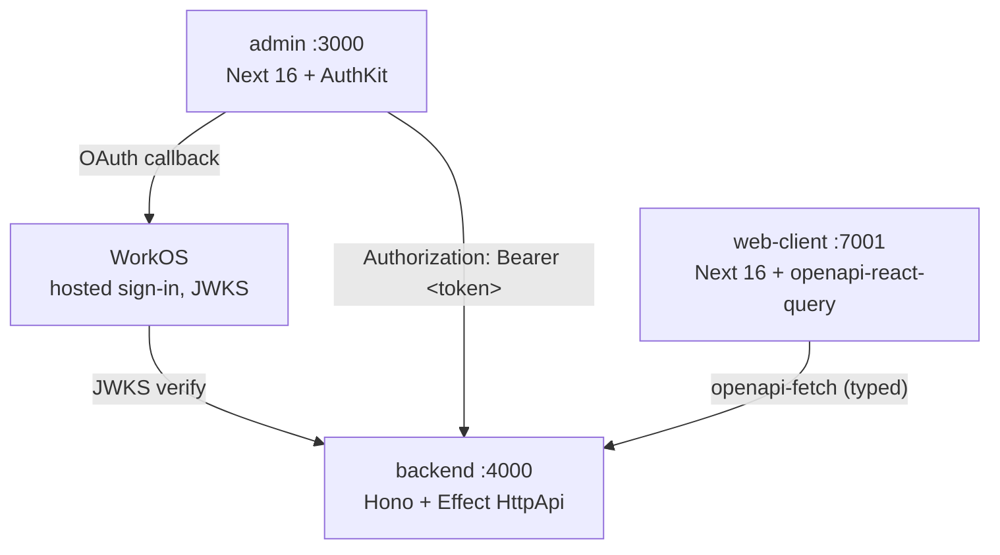

A pnpm monorepo with three deployable apps. Everything ships to Cloudflare
Workers — backend natively, the Next.js apps via OpenNext. Auth crosses every
boundary: WorkOS issues access tokens, the backend verifies them.

## Layout

```text
darna-stack/
├── apps/
│   ├── backend/       Hono + Effect HttpApi on :4000 (wrangler dev)
│   ├── admin/         Next.js 16 admin panel on :3000
│   ├── web-client/    Next.js 16 client app on :7001
│   └── docs/          Fumadocs site on :3001 (this app)
├── infra/             deploy notes, env templates
├── package.json       workspace root
└── pnpm-workspace.yaml
```

## Request flow



The admin obtains a WorkOS access token via AuthKit and forwards it as
`Authorization: Bearer …`. The backend's `Authentication` middleware
verifies the JWT against the WorkOS JWKS for the same `WORKOS_CLIENT_ID`.
The web-client talks to the same backend through a generated, fully-typed
client.

## Sections

<Cards>
  <Card
    title="Local dev"
    href="/docs/local-dev"
    description="Clone, set up .env, run wrangler dev. Fifteen minutes."
  />
  <Card
    title="Backend"
    href="/docs/backend"
    description="HttpApi composition, feature modules, the Worker entrypoint."
  />
  <Card
    title="Web client"
    href="/docs/web-client"
    description="OpenAPI codegen plus openapi-react-query. End-to-end type safety."
  />
  <Card
    title="Auth"
    href="/docs/auth"
    description="WorkOS handshake end-to-end. What lives where."
  />
  <Card
    title="Admin"
    href="/docs/admin"
    description="Next.js 16 with AuthKit. Edge middleware on every route."
  />
  <Card
    title="Tracing"
    href="/docs/tracing"
    description="OpenTelemetry to Grafana via @microlabs/otel-cf-workers."
  />
  <Card
    title="Deploy"
    href="/docs/deploy"
    description="Wrangler for backend, OpenNext for the Next.js apps."
  />
</Cards>

## Conventions

- **Package names** — `@darna/backend`, `@darna/admin`, `@darna/docs`,
  `web-client`. Workspace filters use these (`pnpm --filter @darna/backend …`).
- **Ports** — backend `4000`, admin `3000`, docs `3001`, web-client `7001`.
  Hardcoded in each `dev` script so `pnpm dev` (parallel) doesn't collide.
- **Wrangler** — every deployable app has its own `wrangler.jsonc`.
  `compatibility_date` is the same across all of them.
- **Env files** — `apps/backend/.env` (read by `wrangler dev --env-file=.env`),
  `apps/<next-app>/.env.local` (read by `next dev`). All gitignored, all
  with a `.example` next to them. Production secrets go through
  `wrangler secret put`.
- **Effect** — backend code uses Effect `Service` + `Layer` for DI. HTTP
  surface is `@effect/platform`'s `HttpApi`. One `TracingLayer` provides
  the global OTel tracer.

## Top-level scripts

| Command          | What it does                                 |
| ---------------- | -------------------------------------------- |
| `pnpm dev`       | All apps in parallel                         |
| `pnpm typecheck` | Recursive `tsc --noEmit`                     |
| `pnpm deploy`    | Backend → admin → docs to Cloudflare Workers |
