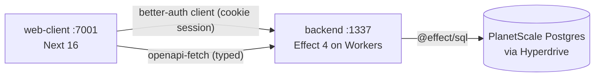

A pnpm monorepo with two deployable apps plus this docs site. Everything runs
on Cloudflare Workers. The backend is an Effect 4 app; the web client is
Next.js 16. There's no separate identity provider — auth lives inside the
backend — and the web client only ever talks to the backend.

## Layout

```text
darna-stack/
├── apps/
│   ├── backend/       Effect 4 HttpApi on Workers, :1337 (alchemy dev)
│   ├── web-client/    Next.js 16, :7001
│   └── docs/          Fumadocs site, :3001 (this app)
├── infra/             deploy notes
├── packages/lint/     shared eslint + prettier config
└── pnpm-workspace.yaml
```

## How a request flows


```mermaid
flowchart LR
  Web["web-client :7001<br/>Next 16"]
  Backend["backend :1337<br/>Effect 4 on Workers"]
  DB[("PlanetScale Postgres<br/>via Hyperdrive")]

  Web -- "better-auth client (cookie session)" --> Backend
  Web -- "openapi-fetch (typed)" --> Backend
  Backend -- "@effect/sql" --> DB
```

The web client signs in through better-auth, which the backend mounts at
`/api/auth/*`. The session is a cookie; every API call sends it with
`credentials: "include"`. Calls go through a fully-typed client generated from
the backend's OpenAPI spec. Postgres is reached over `@effect/sql` through a
Cloudflare Hyperdrive binding that points at a PlanetScale database.

## Conventions

- **Package names** — `@darna/backend`, `@darna/docs`, and `web-client`
  (unscoped). Filters use these: `pnpm --filter @darna/backend …`.
- **Ports** — backend `1337`, web-client `7001`, docs `3001`. Hardcoded in each
  `dev` script so `pnpm dev` (parallel) doesn't collide.
- **Infra as code** — the backend's Cloudflare resources (Worker, Hyperdrive,
  R2, the PlanetScale database, the notification Workflow) are declared in
  `apps/backend/alchemy.run.ts` and applied by [Alchemy](https://alchemy.run).
  The Next.js apps deploy through OpenNext.
- **Effect on the backend** — services and their dependencies are wired with
  Effect `Layer`s. The HTTP surface is `HttpApi` from
  `effect/unstable/httpapi`; repositories use `@effect/sql`.
- **Env files** — `apps/backend/.env` and `apps/web-client/.env.local`, both
  gitignored. Production config is set on the Workers at deploy time.

## Scripts (repo root)

| Command          | What it does                    |
| ---------------- | ------------------------------- |
| `pnpm dev`       | All apps in parallel            |
| `pnpm typecheck` | `tsc --noEmit` in every package |
| `pnpm deploy`    | Deploy every app to Cloudflare  |

## Sections

<Cards>
  <Card
    title="Local dev"
    href="/docs/local-dev"
    description="Install, fill in .env, run pnpm dev."
  />
  <Card
    title="Backend"
    href="/docs/backend"
    description="Effect HttpApi, feature slices, @effect/sql, the Alchemy Worker."
  />
  <Card
    title="Auth"
    href="/docs/auth"
    description="better-auth, cookie sessions, the Authentication middleware."
  />
  <Card
    title="Web client"
    href="/docs/web-client"
    description="OpenAPI codegen + openapi-react-query. End-to-end types."
  />
  <Card
    title="Tracing"
    href="/docs/tracing"
    description="OpenTelemetry from Effect spans, exported to Grafana."
  />
  <Card
    title="Deploy"
    href="/docs/deploy"
    description="Alchemy for the backend, OpenNext for the Next.js apps."
  />
</Cards>
