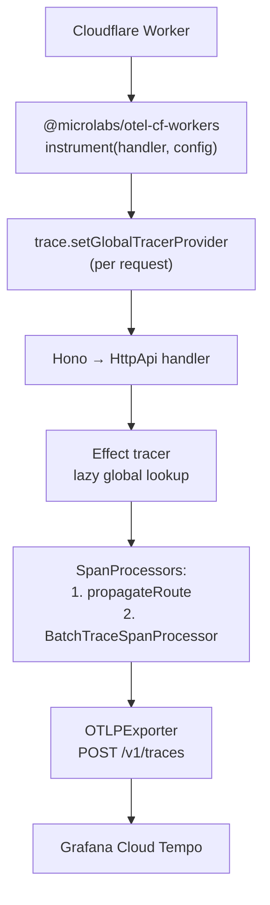

The backend ships every Effect span to Grafana Cloud over OTLP/HTTP. No
collector, no agent. The Worker entrypoint is wrapped with
`@microlabs/otel-cf-workers`, which registers a real `TracerProvider` per
request and flushes spans through `ctx.waitUntil` before the isolate
suspends. Effect's tracer plugs into the same provider, so
`Effect.withSpan(...)` calls land in the same trace tree as the auto-
instrumented inbound fetch and Hyperdrive spans.

## Architecture



The two non-obvious pieces:

1. **Lazy tracer.** `@effect/opentelemetry`'s `Tracer.layerGlobalTracer`
   captures the global `TracerProvider` at layer-build time. On Workers
   that's module load — _before_ `instrument(...)` registers the real
   provider on the first request. We work around this by providing a
   tracer that re-resolves `trace.getTracer(...)` on every `startSpan`
   call. Lives in
   [`lib/effect/tracing.ts`](https://github.com/darnadigital/darna-stack/blob/master/apps/backend/src/lib/effect/tracing.ts).
2. **Route-name propagation.** `@microlabs` only renames the root span
   from `fetchHandler GET` to `GET <route>` if it sees `http.route` on
   the root. Effect sets `http.route` on its own `http.server` _child_
   span. A custom `SpanProcessor` in
   [`worker.ts`](https://github.com/darnadigital/darna-stack/blob/master/apps/backend/src/worker.ts)
   copies the attribute up to the root before the root ends.

## What gets exported

| Span                             | Source                                | When it appears                             |
| -------------------------------- | ------------------------------------- | ------------------------------------------- |
| `<METHOD> <route>`               | @microlabs root                       | Every request (renamed from `fetchHandler`) |
| `http.server <METHOD>`           | Effect HttpApi auto                   | Once per request, `http.route` set on it    |
| `Todos.list`, `Todos.getById`, … | `Effect.withSpan` in services         | Once per service call                       |
| `pg.todos.list`, …               | `tryDb(name, …)`                      | Once per database query                     |
| `hyperdrive_connect`             | @microlabs Hyperdrive instrumentation | Connection acquisition                      |
| `<host>` (CLIENT)                | @microlabs fetch instrumentation      | Outbound `fetch()` subrequests              |

Resource attributes:

| Attribute                        | Value                                         |
| -------------------------------- | --------------------------------------------- |
| `service.name`                   | `darna-backend`                               |
| `service.namespace`              | `production` / `staging` / `local` (from env) |
| `service.version`                | `0.0.0`                                       |
| `cloud.platform`, `cloud.region` | Auto-populated by @microlabs                  |

## Configuration

Two secrets, one var. All come from the Grafana Cloud OTLP integration page
(Connections → Add new connection → OpenTelemetry):

| Variable                      | Where                                                       |
| ----------------------------- | ----------------------------------------------------------- |
| `OTEL_EXPORTER_OTLP_ENDPOINT` | `wrangler secret put` (per env)                             |
| `GRAFANA_OTEL_AUTH_HEADER`    | `wrangler secret put` (per env)                             |
| `OTEL_DEPLOYMENT_ENV`         | `vars` block in `wrangler.jsonc` (`production` / `staging`) |

For local dev, all three live in `apps/backend/.env`. Wrangler exposes
them on the `env` arg via `wrangler dev --env-file=.env`.

```bash
# apps/backend/.env
OTEL_EXPORTER_OTLP_ENDPOINT=https://otlp-gateway-prod-eu-north-0.grafana.net/otlp
GRAFANA_OTEL_AUTH_HEADER=Basic <paste from Grafana>
OTEL_DEPLOYMENT_ENV=local
```

The auth header is the full `Basic <base64>` string Grafana shows. Don't
split it.

## Adding spans

Inside any Effect:

```ts
const list = (): Effect.Effect<readonly Todo[]> => repo.list().pipe(Effect.withSpan("Todos.list"));

const getById = (id: TodoId): Effect.Effect<Todo, TodoNotFound> =>
  Effect.gen(function* () {
    const todo = yield* repo.findById(id);
    if (!todo) return yield* Effect.fail(new TodoNotFound({ id }));
    return todo;
  }).pipe(Effect.withSpan("Todos.getById", { attributes: { "todo.id": id } }));
```

Around any drizzle query, use `tryDb(name, run)` from
[`lib/effect/storage.ts`](https://github.com/darnadigital/darna-stack/blob/master/apps/backend/src/lib/effect/storage.ts) — it adds the span automatically and turns
thrown errors into Effect defects:

```ts
list: () =>
  tryDb("pg.todos.list", () => db.select().from(todos)).pipe(
    Effect.map((rows) => rows.map(rowToTodo)),
  );
```

Around outbound HTTP, just wrap the promise:

```ts
yield *
  Effect.tryPromise({
    try: () => fetch(url),
    catch: (cause) => new IntegrationError({ cause }),
  }).pipe(Effect.withSpan("workos.jwks.fetch"));
```

### Naming

- `<Service>.<method>` for service operations: `Todos.create`,
  `WorkOS.verifyAccessToken`.
- `<dependency>.<resource>.<op>` for I/O: `pg.todos.insert`, `r2.assets.put`.
- Lowercase, dot-separated, low cardinality.

## Querying in Grafana

Explore → Tempo → TraceQL. Common queries:

```text
# Everything from the prod backend
{ resource.service.name = "darna-backend" && resource.service.namespace = "production" }

# Just the not-found spans
{ name = "Todos.getById" && status = error }

# Slow list operations
{ name = "Todos.list" && duration > 100ms }

# By todo id
{ span.todo.id = "<uuid>" }

# Effect spans only (skip @microlabs auto-instrumentation)
{ resource.service.name = "darna-backend" && name !~ "fetchHandler.*" }
```

The trace list shows the @microlabs root span; click in to see the full
tree (`http.server` → `Todos.list` → `pg.todos.list`).

## Verifying the auth credentials

If spans aren't landing, isolate the credentials with a hand-rolled OTLP
POST:

```bash
( cd apps/backend && \
  export $(grep -v '^#' .env | grep -E '^(OTEL|GRAFANA)' | xargs) && \
  curl -i -X POST "${OTEL_EXPORTER_OTLP_ENDPOINT}/v1/traces" \
    -H "Authorization: ${GRAFANA_OTEL_AUTH_HEADER}" \
    -H 'content-type: application/json' \
    -d '{"resourceSpans":[]}' )
```

| Response      | Meaning                                                                               |
| ------------- | ------------------------------------------------------------------------------------- |
| `200` / `202` | Auth + URL good. Issue is on our pipeline side.                                       |
| `401`         | Wrong auth header. Re-grab from Grafana.                                              |
| `403`         | Token missing `traces:write`. Recreate via Cloud Access Policies.                     |
| `404`         | Endpoint URL wrong (most often a region typo: `prod-eu-north-0` vs `prod-eu-west-2`). |
| `ENOTFOUND`   | Hostname typo in `OTEL_EXPORTER_OTLP_ENDPOINT`.                                       |

## Why both @microlabs and @effect/opentelemetry?

`@effect/opentelemetry` provides Effect's `Tracer` service — the thing
that turns `Effect.withSpan(...)` into actual OTel spans. It needs a real
OTel `TracerProvider` to be useful.

`@microlabs/otel-cf-workers` provides that `TracerProvider` for
Cloudflare Workers, with the right semantics for the runtime: per-request
context via AsyncLocalStorage, span flushing via `ctx.waitUntil`, and
auto-instrumentation for fetch and binding calls.

Without @microlabs, Effect spans would be created against a no-op
`TracerProvider` and silently dropped. Without `@effect/opentelemetry`,
you'd lose the Effect-native `withSpan` ergonomics. Together they cover
the gap.

## Why we don't use Cloudflare's native trace destinations

Cloudflare's `observability.traces.destinations` only emits a fixed set
of runtime spans (inbound fetch, a few binding ops). It does _not_
register a `TracerProvider` for application code, so there's nowhere for
`Effect.withSpan(...)` calls to land. We use the OTel-native path
instead and let `@microlabs` handle export + flush.

## Files

| Path                                     | Role                                                                       |
| ---------------------------------------- | -------------------------------------------------------------------------- |
| `apps/backend/src/worker.ts`             | `instrument(...)` wrapper, `propagateRouteProcessor`, OTLP exporter config |
| `apps/backend/src/server.ts`             | Hono middleware that sets `http.route` for non-API routes                  |
| `apps/backend/src/lib/effect/tracing.ts` | `TracingLayer` with the lazy global tracer                                 |
| `apps/backend/src/lib/effect/storage.ts` | `tryDb` — Effect wrapper that adds a span around drizzle promises          |
| `apps/backend/wrangler.jsonc`            | `vars.OTEL_DEPLOYMENT_ENV`                                                 |
| `apps/backend/.env.example`              | Local dev template                                                         |
