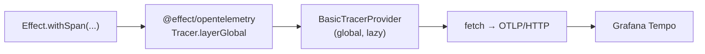

The backend turns Effect spans into OpenTelemetry traces and POSTs them to
Grafana over OTLP/HTTP. No collector, no agent, no `@microlabs` wrapper — just
a small provider in
[`observability/tracing.ts`](https://github.com/darnadigital/darna-stack/blob/master/apps/backend/src/observability/tracing.ts).

## How it works


```mermaid
flowchart LR
  Eff["Effect.withSpan(...)"]
  Bridge["@effect/opentelemetry<br/>Tracer.layerGlobal"]
  Provider["BasicTracerProvider<br/>(global, lazy)"]
  Exporter["fetch → OTLP/HTTP"]
  Grafana["Grafana Tempo"]

  Eff --> Bridge --> Provider --> Exporter --> Grafana
```

- **`tracerBridge(namespace)`** provides `@effect/opentelemetry`'s global tracer,
  so `Effect.withSpan(...)` lands on the global OTel `TracerProvider`.
- **`ensureTracingProvider(...)`** lazily builds that provider once: a
  `BasicTracerProvider` with a `BatchSpanProcessor` and a small fetch-based OTLP
  exporter that POSTs serialized spans to `<endpoint>/v1/traces` with the
  Grafana auth header.
- In `worker.ts`, each request is wrapped in a root span (`<METHOD> <path>`)
  under the bridge, and `ctx.waitUntil(processor.forceFlush())` flushes before
  the isolate suspends. Background workflows do the same through
  `withWorkflowTracing(...)`.

Tracing is **off** unless both `OTEL_EXPORTER_OTLP_ENDPOINT` and
`GRAFANA_OTEL_AUTH_HEADER` are set — local dev runs traceless by default.

## What gets exported

Resource: `service.name = darna-backend`, `service.namespace` from
`OTEL_DEPLOYMENT_ENV`. Spans you'll see in a request:

| Span                            | Source                                      |
| ------------------------------- | ------------------------------------------- |
| `GET /api/tasks/...`            | root request span (`worker.ts`)             |
| `Tasks.list`, `Projects.show`   | `Effect.withSpan` in services               |
| `db.tasks.list`, `db.tasks.get` | `tryQuery(name, …)` around each SQL query   |
| `Auth.getSession`               | the Authentication middleware               |
| `workflow.task-notification`, `step.send-reminder` | the notification workflow |

## Adding spans

Wrap any Effect:

```ts
const list = () => repo.list().pipe(Effect.withSpan("Tasks.list"));
```

Database queries get a span for free through `tryQuery(name, effect)` (in
`layers/db/db.ts`) — it labels the span and maps failures to `StorageError`:

```ts
list: () =>
  tryQuery("db.tasks.list", Effect.gen(function* () {
    const sql = yield* getSql;
    return yield* sql`select id, title, done from tasks`;
  }));
```

Naming: `<Service>.<method>` for logic (`Tasks.create`), `db.<table>.<op>` for
queries (`db.tasks.insert`). Lowercase, dotted, low cardinality.

## Configuration

| Variable                      | Default       | Notes                                  |
| ----------------------------- | ------------- | -------------------------------------- |
| `OTEL_EXPORTER_OTLP_ENDPOINT` | _(empty)_     | Grafana OTLP gateway base URL          |
| `GRAFANA_OTEL_AUTH_HEADER`    | _(empty)_     | full `Basic <base64>` string           |
| `OTEL_DEPLOYMENT_ENV`         | `development` | becomes `service.namespace`            |
| `OTEL_ENABLED`                | `true`        | hard off-switch                        |
| `OTEL_SAMPLE_RATE`            | `1`           | head sampling, `0`–`1`                 |

Both `OTEL_*` endpoint and the auth header must be present, or tracing
no-ops. Grab both from Grafana → Connections → OpenTelemetry. The auth header
is the whole `Basic <base64>` string — don't split it.

## Why a hand-rolled provider?

`@effect/opentelemetry` gives Effect its `Tracer`, but it needs a real OTel
`TracerProvider` to export anything. Rather than pull in a Workers-specific
wrapper, the backend registers a `BasicTracerProvider` with a `fetch`-based
exporter — that's all the Workers runtime needs, and it keeps the dependency
surface small.
