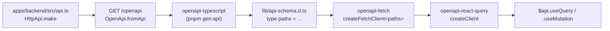

`apps/web-client` consumes the backend through generated OpenAPI types,
fed into `openapi-fetch` and `openapi-react-query`. Every request path,
parameter, and response shape is checked at compile time. No runtime
schema validation in the browser, no shared types package — just one
generated `.d.ts`.

## Why generated types, not direct imports

The backend's `Api` class technically lives at `@darna/backend/api` (it's
a workspace export). Importing it directly into the web-client would
couple the browser bundle to the backend's full dependency tree —
`@effect/platform`, drizzle, jose, pg. Even tree-shaking wouldn't fully
help here: Effect Schema definitions reference each other through
runtime instances.

Generated types decouple them. The contract is the OpenAPI spec the
backend already produces from the same `Api`. Web-client gets a static
`paths` type; that's all it needs.

## How it stitches together



The backend's `OpenApi.fromApi(Api)` produces the spec at runtime; Hono
serves it at `/openapi`. `openapi-typescript` walks the spec and emits
TypeScript types that mirror every operation. `openapi-fetch` wraps
`fetch` to require valid path/method combinations. `openapi-react-query`
adds React Query hooks on top.

## The client

```ts
// apps/web-client/lib/api.ts
import createFetchClient from "openapi-fetch";
import createClient from "openapi-react-query";
import type { paths } from "./api-schema";

const baseUrl = process.env.NEXT_PUBLIC_API_URL ?? "http://localhost:4000";

const fetchClient = createFetchClient<paths>({ baseUrl });

export const $api = createClient(fetchClient);
```

That's the whole client. `$api` exposes `useQuery`, `useMutation`,
`useSuspenseQuery`, etc., each parameterised by an HTTP method and a
literal path string. Wrong path? Type error. Missing path param? Type
error. Body shape that doesn't match the OpenAPI schema? Type error.

## Calling endpoints

```tsx
"use client";
import { $api } from "@/lib/api";

export function TodoList() {
  // GET /api/todos — fully typed.
  const { data, isLoading } = $api.useQuery("get", "/api/todos");

  // POST /api/todos — body is checked against CreateTodo.
  const create = $api.useMutation("post", "/api/todos");

  if (isLoading) return <p>Loading…</p>;
  return (
    <ul>
      {data?.map((t) => (
        <li key={t.id}>{t.title}</li>
      ))}
    </ul>
  );
}
```

`data` is typed as `Todo[]` even though no `Todo` type was ever imported
from the backend. The shape comes from `paths`, which came from the
OpenAPI spec, which came from the backend's `HttpApiGroup` declarations.

## Regenerating types

After every backend route change:

```bash
# in one terminal
pnpm dev:backend

# in another
pnpm --filter web-client gen:api
```

`gen:api` runs `openapi-typescript http://localhost:4000/openapi -o
lib/api-schema.d.ts`. The script lives in
[`apps/web-client/package.json`](https://github.com/darnadigital/darna-stack/blob/master/apps/web-client/package.json).
Commit the regenerated `api-schema.d.ts` along with the backend change so
CI sees a consistent diff.

<Callout type="info">
  No CI step regenerates this for you yet. If you forget, the web-client typechecks against the
  *old* contract — usually still passes, but with stale fields. Worth a pre-commit hook if it
  becomes a habit.
</Callout>

## What's typed, what's not

- **Typed at compile time** — paths, methods, path params, query params,
  request bodies, success responses, declared error responses.
- **Not typed** — anything the backend returns that isn't declared in the
  `HttpApiGroup` (don't do that — declare it). Network failures, 5xx
  bodies, malformed JSON. These come back as `Error` from React Query.

Effect Schema validates request payloads server-side, so a type-checked
client request that turns out to violate a runtime constraint
(`Schema.minLength`, etc.) gets a 400 with the validation error. The
client doesn't re-validate.

## Auth

The web-client doesn't currently authenticate against any of the existing
routes — `/api/todos` and `/api/projects` are open. The admin app
demonstrates the pattern for protected routes: add
`Authorization: Bearer <token>` via `openapi-fetch`'s `headers` option,
backed by whatever your auth provider gives you.

```ts
const fetchClient = createFetchClient<paths>({
  baseUrl,
  // headers can be a function for per-request resolution
  headers: () => ({ Authorization: `Bearer ${getAccessToken()}` }),
});
```

See [Auth](/docs/auth) for the WorkOS handshake the admin uses.
