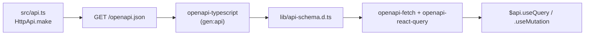

`web-client` is a Next.js 16 app that talks only to the backend, and only
through types generated from the backend's OpenAPI spec. Change a route on the
backend, regenerate, and any mismatch becomes a compile error here. No shared
types package, no runtime schema validation in the browser — just one generated
`.d.ts`.

## Why generated types, not a shared package

The backend's `Api` is a workspace export, but importing it into the browser
bundle would drag in its whole dependency tree (`@effect/platform`,
`@effect/sql`, `pg`, …), and Effect Schema instances reference each other at
runtime so tree-shaking can't save you. Generating types from the OpenAPI spec
keeps the contract without the coupling: the web client only ever sees a static
`paths` type.


```mermaid
flowchart LR
  Api["src/api.ts<br/>HttpApi.make"] --> Spec["GET /openapi.json"]
  Spec --> Codegen["openapi-typescript<br/>(gen:api)"]
  Codegen --> Types["lib/api-schema.d.ts"]
  Types --> Client["openapi-fetch + openapi-react-query"]
  Client --> Hooks["$api.useQuery / .useMutation"]
```

## API client

`lib/api.ts` wires [`openapi-fetch`](https://openapi-ts.dev) and
[`openapi-react-query`](https://openapi-ts.dev/openapi-react-query) over the
generated `paths`. `credentials: "include"` makes the better-auth session
cookie ride along on every cross-origin request:

```ts
// lib/api.ts
const baseUrl = process.env.NEXT_PUBLIC_API_URL ?? "http://localhost:4000";
const fetchClient = createFetchClient<paths>({ baseUrl, credentials: "include" });
export const $api = createClient(fetchClient);
```

Use `$api` for fully-typed queries and mutations — wrong path, missing param,
or a body that doesn't match the schema are all type errors:

```tsx
const { data } = $api.useQuery("get", "/api/projects");   // data: Project[]
const create = $api.useMutation("post", "/api/projects");
```

`data` is typed without ever importing a `Project` type — the shape comes from
`paths`, which came from the spec, which came from the backend's schema.

<Callout type="warn">
  Set `NEXT_PUBLIC_API_URL` in `apps/web-client/.env.local`. The fallback in
  code is `:4000`, but the local backend runs on `:1337`.
</Callout>

## Auth client

`lib/auth-client.ts` is better-auth's React client, also pinned to
`credentials: "include"`:

```ts
export const authClient = createAuthClient({
  baseURL,                                  // appends /api/auth
  fetchOptions: { credentials: "include" },
});
export const { signIn, signUp, signOut, useSession } = authClient;
```

`useSession()` gives components reactive access to the current user. See
[Auth](/docs/auth) for the backend side.

## Regenerating types

After every backend route change:

```bash
pnpm dev:backend                       # serve the spec at :1337
pnpm --filter web-client gen:api       # writes lib/api-schema.d.ts
```

`gen:api` runs `openapi-typescript http://localhost:1337/openapi.json -o
lib/api-schema.d.ts`. Commit the regenerated file alongside the backend change
so the diff stays consistent.

<Callout type="info">
  Nothing regenerates this for you. Forget, and the web client typechecks
  against the *old* contract — usually still passes, just with stale fields.
</Callout>
